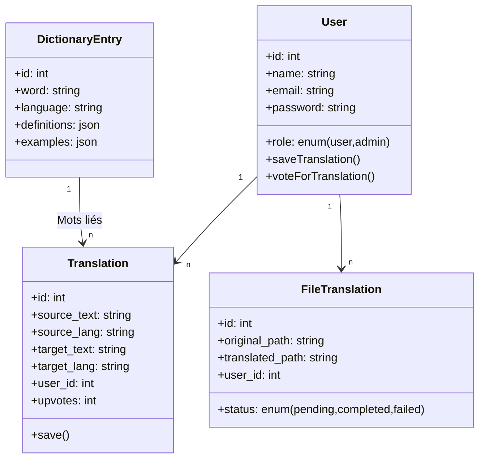
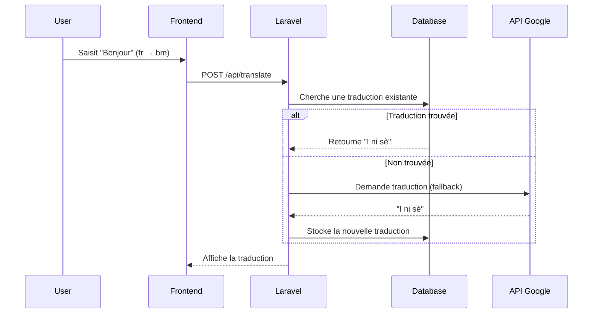

# Traducteur
Je souhaite coder un site de traduction avec pour un début:  un traducteur de langue(pour un début on va avec le fr, en, bm) ensuite un dictionnaire de mots bambara et enfin traducteur de fichier comme sur google translate.

Voici une **solution complète** pour votre projet, incluant :  
1. **Use Case** (fonctionnalités clés),  
2. **Diagramme de classe** (architecture backend),  
3. **Schéma de base de données** (MySQL/PostgreSQL),  
4. **Technologies recommandées** (Vue 3 + Laravel + Inertia).  

---

### **1. Use Case (Fonctionnalités Principales)**  
#### **A. Traducteur de texte**  
- **Acteurs** : Utilisateurs anonymes et connectés.  
- **Scénario** :  
  - Saisir un texte (fr/en/bm).  
  - Choisir la langue cible.  
  - Afficher la traduction (+ option de correction collaborative).  

#### **B. Dictionnaire Bambara**  
- **Acteurs** : Utilisateurs connectés (contributions modérées).  
- **Scénario** :  
  - Rechercher un mot (fr/en → bm ou inversement).  
  - Proposer des traductions alternatives.  
  - Ajouter des exemples d’usage.  

#### **C. Traducteur de fichiers**  
- **Acteurs** : Utilisateurs connectés (limite de taille).  
- **Scénario** :  
  - Uploader un fichier (.txt, .docx, .pdf).  
  - Traduire le contenu (via API ou traitement manuel).  
  - Télécharger le fichier traduit.  

---

### **2. Diagramme de Classe (Backend Laravel)**  

---

### **3. Schéma de Base de Données (MySQL/PostgreSQL)**  
#### **Table `users`**  
| Champ       | Type          | Description                |
|-------------|---------------|----------------------------|
| id          | BIGINT (PK)   | ID unique                  |
| name        | VARCHAR(255)  | Nom utilisateur            |
| email       | VARCHAR(255)  | Email (unique)             |
| password    | VARCHAR(255)  | Mot de passe hashé         |
| role        | ENUM          | `user` ou `admin`          |

#### **Table `translations`**  
| Champ          | Type          | Description                          |
|----------------|---------------|--------------------------------------|
| id             | BIGINT (PK)   | ID unique                            |
| source_text    | TEXT          | Texte source (ex: "Bonjour")         |
| source_lang    | VARCHAR(3)    | Langue source (fr/en/bm)             |
| target_text    | TEXT          | Texte traduit (ex: "I ni sè")        |
| target_lang    | VARCHAR(3)    | Langue cible (fr/en/bm)              |
| user_id        | BIGINT (FK)   | Auteur de la traduction              |
| upvotes        | INTEGER       | Votes positifs (qualité)             |
| created_at     | TIMESTAMP     | Date de création                     |

#### **Table `dictionary_entries`**  
| Champ          | Type          | Description                          |
|----------------|---------------|--------------------------------------|
| id             | BIGINT (PK)   | ID unique                            |
| word           | VARCHAR(255)  | Mot en bambara (ex: "Nba")           |
| language       | VARCHAR(3)    | Langue du mot (fr/en/bm)             |
| definitions    | JSON          | Définitions multiples (ex: {"fr": "Ami", "en": "Friend"}) |
| examples       | JSON          | Phrases d’exemple                    |

#### **Table `file_translations`**  
| Champ          | Type          | Description                          |
|----------------|---------------|--------------------------------------|
| id             | BIGINT (PK)   | ID unique                            |
| original_path  | VARCHAR(255)  | Chemin du fichier original           |
| translated_path| VARCHAR(255)  | Chemin du fichier traduit             |
| status         | ENUM          | `pending`, `completed`, `failed`     |
| user_id        | BIGINT (FK)   | Utilisateur qui a uploadé le fichier |

---

### **4. Technologies Recommandées**  
#### **Frontend (Vue 3)**  
- **Composants clés** :  
  - `<TextTranslator>` (textarea + sélecteur de langue).  
  - `<DictionarySearch>` (barre de recherche + résultats).  
  - `<FileUploader>` (drag & drop de fichiers).  

#### **Backend (Laravel)**  
- **API Endpoints** :  
  - `POST /api/translate` (traduction de texte).  
  - `GET /api/dictionary?q=word` (recherche dictionnaire).  
  - `POST /api/translate-file` (traduction de fichiers).  

#### **Modules Externes**  
- **Traduction de fichiers** : Utilisez **LibreOffice CLI** ou **Python (PyPDF2)** pour extraire le texte des PDF/DOCX.  
- **Collaboratif** : Système de votes (`upvotes/downvotes`) pour les traductions utilisateur.  

---

### **5. Workflow Typique**  
1. **Traduction de texte** :  
   - L’utilisateur saisit "Bonjour" (fr → bm).  
   - Laravel cherche une correspondance en base ou utilise une API (Google Translate en fallback).  

2. **Dictionnaire** :  
   - Recherche du mot "Nba" → retourne {"fr": "Ami", "en": "Friend"}.  

3. **Fichiers** :  
   - Upload d’un PDF → extraction du texte → traduction → génération d’un nouveau PDF.  

---

### **6. Bonus : Diagramme de Séquence (Traduction de Texte)**  

---

### **Prochaines Étapes**  
1. **Créer le dépôt Git** avec la structure Laravel + Vue.  
2. **Implémenter l’authentification** (Laravel Breeze ou Sanctum).  
3. **Designer l’UI** (Tailwind CSS recommandé).  

Je peux vous fournir un **template GitHub** ou des extraits de code spécifiques. Dites-moi ce qui vous bloque !
